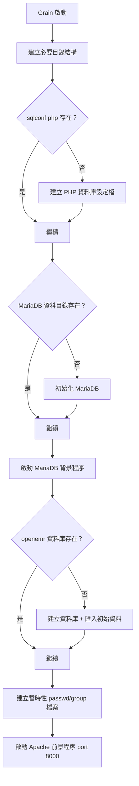

# OpenEMR for Sandstorm 繁體中文指南

## 📋 專案總覽

本專案將 [OpenEMR](https://www.open-emr.org/)（全球領先的開源電子病歷系統）封裝為 [Sandstorm](https://sandstorm.io/) 應用程式。Sandstorm 是一個自架式的 Web 應用程式平台，提供沙盒化的安全執行環境。

**OpenEMR 版本：** 7.0.3  
**授權條款：** GPL v3  
**原始碼：** [GitHub - sandstorm-org/openemr-sandstorm](https://github.com/sandstorm-org/openemr-sandstorm)

---

## 🏗️ 專案架構

```
openemr-sandstorm/
├── .sandstorm/              # Sandstorm 封裝設定（核心目錄）
│   ├── Vagrantfile          # Vagrant 虛擬機設定（基於 Debian Bookworm）
│   ├── sandstorm-pkgdef.capnp  # Sandstorm 套件定義（Cap'n Proto 格式）
│   ├── global-setup.sh      # 全域初始化（安裝 Sandstorm 平台）
│   ├── setup.sh             # 應用程式安裝（安裝 OpenEMR 依賴與配置）
│   ├── build.sh             # 建置腳本（編譯 C 工具程式）
│   ├── launcher.sh          # 啟動腳本（啟動 MariaDB + Apache）
│   ├── environment          # 環境變數定義檔
│   └── stack                # 技術堆疊標記（diy = 自訂堆疊）
├── downloads/               # OpenEMR 原始碼壓縮檔
│   ├── openemr-7.0.3.tar.gz       # OpenEMR 7.0.3 原始碼（~201MB）
│   └── openemr-7.0.3.tar.gz.sha256 # SHA-256 校驗碼
├── metadata/                # Sandstorm App Store 後設資料
│   └── description.md       # 應用程式描述
├── patches/                 # 所有對原始碼的修改（patch 檔）
│   ├── apache2-*.patch      # Apache HTTP Server 設定修改
│   ├── mariadb-*.patch      # MariaDB 設定修改
│   └── openemr-7.0.3/      # OpenEMR 原始碼修改
│       └── openemr/
│           ├── interface/   # UI 層修改（登入、使用者管理）
│           ├── library/     # 認證函式庫修改
│           ├── src/         # 核心程式碼修改（Auth、UserService）
│           └── templates/   # 模板修改（隱藏密碼欄位等）
├── sql/                     # 資料庫腳本
│   ├── create_database.sql  # 建立 openemr 資料庫
│   ├── initial_data.sql     # OpenEMR 初始資料（~14MB）
│   └── sandstorm.sql        # Sandstorm 使用者對應表
├── util/                    # C 語言工具程式
│   ├── Makefile             # 編譯腳本
│   └── src/geteid.c         # 取得 effective UID/GID 的小工具
├── .gitattributes           # Git 行尾設定（強制 LF）
└── .gitignore               # Git 忽略規則
```

---

## 🔑 核心概念

### 什麼是 Sandstorm？

Sandstorm 就像是 Web 應用程式的「容器管理員」。它把每個應用程式實例（稱為 **grain**）放在獨立的沙盒中執行，並且**由 Sandstorm 統一處理使用者認證**。

> [!IMPORTANT]
> Sandstorm 中的應用程式**不需要自己處理登入**。Sandstorm 會透過 HTTP Headers 將使用者資訊傳遞給應用程式：
> - `X-Sandstorm-User-Id` — 使用者 ID
> - `X-Sandstorm-Username` — 使用者名稱
> - `X-Sandstorm-Permissions` — 權限列表
> - 等等...

### 本專案做了什麼？

本專案的核心工作是**將 OpenEMR 的認證機制改為使用 Sandstorm 的認證系統**。主要修改包括：

1. **新增 `AuthSandstorm` 類別** — 讀取 Sandstorm HTTP Headers，取得使用者身份
2. **修改 `AuthUtils`** — 新增 `verifySandstormAuth()` 方法，自動建立/對應 OpenEMR 使用者
3. **修改登入流程** — 在 Sandstorm 環境中跳過傳統登入頁面
4. **修改使用者管理** — 防止透過 OpenEMR 介面新增非 Sandstorm 使用者
5. **新增 `sandstorm_users` 表** — 建立 Sandstorm User ID 與 OpenEMR User ID 的對應關係

### 權限角色對應

Sandstorm 角色會映射到 OpenEMR 的 ACL 群組：

| Sandstorm 角色 | OpenEMR ACL 群組 | 說明 |
|---|---|---|
| Administrator | Administrators | 完全控制 |
| Manager | — | （目前未對應） |
| Back Office | — | （目前未對應） |
| Front Office | Front Office | 客戶/財務/部分醫療 |
| Clinician | Clinicians | 客戶/醫療記錄 |

---

## 🛠️ 技術堆疊

| 元件 | 技術 | 說明 |
|---|---|---|
| Web 伺服器 | Apache 2 | 監聽 port 8000 |
| 資料庫 | MariaDB | 使用 Unix Socket 連線 |
| 後端語言 | PHP | OpenEMR 核心語言 |
| 反向代理 | sandstorm-http-bridge | Sandstorm ↔ 應用程式橋接 |
| 虛擬機 | Vagrant + VirtualBox/libvirt | 開發環境 |
| 封裝工具 | vagrant-spk | Sandstorm 封裝工具 |
| 作業系統 | Debian Bookworm (64-bit) | VM 基礎映像 |

---

## 🚀 開發環境建置

### 必要工具

| 工具 | 用途 | 安裝方式 |
|---|---|---|
| [Vagrant](https://www.vagrantup.com/) | 管理開發用虛擬機 | `winget install Hashicorp.Vagrant` |
| [VirtualBox](https://www.virtualbox.org/) | 虛擬化平台 | `winget install Oracle.VirtualBox` |
| [vagrant-spk](https://github.com/sandstorm-io/vagrant-spk) | Sandstorm 封裝 CLI | 見下方說明 |

### 安裝 vagrant-spk

```powershell
# 下載 vagrant-spk（請從官方 Release 頁面取得最新版）
# https://github.com/sandstorm-io/vagrant-spk/releases
# 將執行檔放入 PATH 中的目錄
```

### 啟動開發環境

```powershell
# 1. 在專案根目錄下啟動 Vagrant VM（首次會花較長時間）
#    這會依序執行 global-setup.sh 和 setup.sh
vagrant-spk vm up

# 2. 啟動 Sandstorm 開發模式
vagrant-spk dev

# 3. 開啟瀏覽器前往
#    http://local.sandstorm.io:6090
```

> [!NOTE]
> `vagrant-spk vm up` 會：
> 1. 下載 Debian Bookworm VM 映像
> 2. 安裝 Sandstorm 平台（`global-setup.sh`）
> 3. 安裝 OpenEMR 依賴並套用 patch（`setup.sh`）
>
> `vagrant-spk dev` 會：
> 1. 編譯工具程式（`build.sh`）
> 2. 啟動 MariaDB 和 Apache（`launcher.sh`）

### 常用開發指令

```powershell
# SSH 進入 VM
vagrant-spk vm ssh

# 停止 VM
vagrant-spk vm halt

# 銷毀 VM（重新開始）
vagrant-spk vm destroy
```

---

## 📦 建置與部署

### 建置 Sandstorm 套件 (.spk)

```powershell
vagrant-spk pack openemr.spk
```

這會產生一個 `.spk` 檔案，可以上傳到 Sandstorm 伺服器安裝。

### 部署到 Sandstorm 伺服器

1. 登入你的 Sandstorm 伺服器（例如 `https://your-sandstorm.example.com`）
2. 點選「Upload App」
3. 上傳 `openemr.spk` 檔案
4. 建立新的 grain 即可使用

---

## 🔧 開發流程

### 修改 OpenEMR 程式碼

本專案**不直接修改 OpenEMR 原始碼**，而是使用 **patch 檔** 來管理所有變更。

#### 建立新的 Patch

```bash
# 在專案根目錄操作，進入 VM
vagrant-spk vm ssh

# 1. 備份原始檔案
cp /opt/openemr-7.0.3/openemr/path/to/file.php \
   /opt/openemr-7.0.3/openemr/path/to/file.php.orig

# 2. 修改檔案
nano /opt/openemr-7.0.3/openemr/path/to/file.php

# 3. 產生 patch
diff -u /opt/openemr-7.0.3/openemr/path/to/file.php.orig \
        /opt/openemr-7.0.3/openemr/path/to/file.php \
   > /opt/app/patches/openemr-7.0.3/openemr/path/to/file.php.patch
```

#### 現有 Patch 檔案列表

| Patch 檔案 | 修改目的 |
|---|---|
| `interface/login/login.php` | 允許 Sandstorm iframe 嵌入、要求認證 |
| `interface/main/main_screen.php` | 主畫面修改 |
| `interface/main/tabs/main.php` | 分頁修改 |
| `interface/usergroup/usergroup_admin.php` | 使用者管理修改 |
| `interface/usergroup/usergroup_admin_add.php` | **移除**新增使用者頁面（Sandstorm 自動建立） |
| `interface/usergroup/user_admin.php` | 使用者編輯修改 |
| `library/auth.inc.php` | 注入 Sandstorm 認證邏輯 |
| `src/Common/Auth/AuthSandstorm.php` | **新增**：Sandstorm 認證類別 |
| `src/Common/Auth/AuthUtils.php` | 新增 `verifySandstormAuth()` 方法 |
| `src/Services/UserService.php` | 新增使用者建立方法 |
| `templates/...` | UI 模板修改（隱藏密碼欄位等） |

### 修改伺服器設定

- **Apache 設定** → `patches/apache2-*.patch`
- **MariaDB 設定** → `patches/mariadb-*.patch`

---

## 🗄️ 資料庫結構

### Sandstorm 專用表

```sql
-- sandstorm_users：Sandstorm 使用者 ↔ OpenEMR 使用者對應表
CREATE TABLE sandstorm_users (
  id              BIGINT(20)  NOT NULL AUTO_INCREMENT,
  user_id         BIGINT(20)  NOT NULL,  -- 對應 users.id
  sandstorm_user_id BINARY(16) NOT NULL,  -- X-Sandstorm-User-Id
  PRIMARY KEY (id),
  FOREIGN KEY (user_id) REFERENCES users(id) ON DELETE CASCADE ON UPDATE CASCADE
);
```

### 資料庫連線設定

- **主機：** `localhost`（Unix Socket）
- **Socket：** `/var/run/mysqld/mysqld.sock`
- **使用者：** `openemr`
- **密碼：** `openemr`
- **資料庫：** `openemr`
- **編碼：** `utf8mb4`

---

## 📂 啟動流程

應用程式啟動時（每次 grain 啟動），`launcher.sh` 會依序：



---

## ⚠️ Windows 開發注意事項

### 行尾符號（Line Endings）

> [!WARNING]
> 這是在 Windows 上開發本專案最重要的問題。Shell 腳本和 patch 檔案**必須使用 LF 行尾**，否則在 Linux VM 內執行會失敗。

專案已透過 `.gitattributes` 處理：
```
.sandstorm/environment text eol=lf
.sandstorm/*.sh text eol=lf
downloads/*.sha256 text eol=lf
patches/** text eol=lf     # 注意：原始檔有 typo "test" 應為 "text"
```

**建議的 Git 設定：**
```powershell
# 不自動轉換行尾
git config core.autocrlf input
```

### 已知的 `.gitattributes` 問題

第 9 行有一個 typo：`test eol=lf` 應為 `text eol=lf`。這會導致 patch 檔案的行尾符號設定**未生效**。

### VirtualBox 需求

本專案的開發環境基於 Vagrant + VirtualBox。在 Windows 上需要：

1. 確認 VirtualBox + vagrant-spk 已安裝
2. 啟動開發環境：
   ```powershell
   vagrant-spk vm up
   vagrant-spk dev
   ```

---

## 🧪 測試

### 本地測試（Vagrant）

```powershell
# 啟動開發環境
vagrant-spk vm up
vagrant-spk dev

# 開啟瀏覽器
# http://local.sandstorm.io:6090
# 建立帳號、建立新的 OpenEMR grain
```

### Sandstorm 上測試

```powershell
# 建置 .spk 套件
vagrant-spk pack ../openemr.spk

# 上傳到 Sandstorm 伺服器測試
```

---

## 📡 ClinicCalendar HTTP API

本專案透過 Sandstorm 的 **HTTP API export** 機制，將 OpenEMR 的行事曆資料以 JSON API 的形式對外提供。外部應用程式（例如預約系統）可以透過 API Token 來呼叫這些端點。

### 架構概覽

```
外部客戶端 (test/api/test_http_api.ts 或其他 Sandstorm grain)
       │
       │ HTTP GET + Authorization: Bearer <token>
       ▼
┌───────────────────────────────┐
│ Sandstorm Platform            │
│   驗證 API Token → 路由到 grain │
└──────────┬────────────────────┘
           │ 加入 X-Sandstorm-* Headers
           ▼
┌───────────────────────────────┐
│ sandstorm-http-bridge         │
│   apiPath = "/api"            │
│   前綴 /api 到請求路徑         │
└──────────┬────────────────────┘
           │ /api/get_available_slots.php
           ▼
┌───────────────────────────────┐
│ Apache (port 8000)            │
│   → PHP 處理 → 查詢 MariaDB   │
└───────────────────────────────┘
```

### API 端點測試流程 (產生與測試行事曆空檔)

如果需要驗證 `get_available_slots.php` API 的邏輯，可以按照以下步驟建立測試資料並執行自動化測試：

1. **產生測試排班資料**  
   進入 Sandstorm Grain 內部執行 SQL 腳本，為三個測試醫生建立排班與佔用時段：
   ```powershell
   vagrant-spk enter-grain
   # (依提示按下 Enter 選擇運行中的 grain)

   # 在 grain 內部執行：
   mysql -u openemr -popenemr openemr < /opt/app/sql/seed_test_schedules.sql
   exit
   ```

2. **同步 PHP API 變更**  
   沙盒啟動時會將 API 檔案複製過去。如果你在開發過程中修改了 `apis/get_available_slots.php`，必須手動同步到沙盒目錄中：
   ```powershell
   vagrant ssh -c "sudo cp /opt/app/apis/get_available_slots.php /opt/openemr-7.0.3/openemr/apis/get_available_slots.php"
   ```

3. **執行 TypeScript 測試客戶端**  
   使用測試腳本來驗證 API 格式與時段過濾邏輯（需先從 UI 取得 Token）：
   ```powershell
   npx tsx test/api/test_http_api.ts `
     --host "http://api-XXXXX.local.sandstorm.io:6090" `
     --token "YOUR_API_TOKEN" `
     --from "2026-05-11" `
     --to "2026-05-16"
   ```

### API 端點

#### `GET /get_available_slots.php`

取得指定日期範圍內的可用預約空檔。

**Query 參數：**

| 參數 | 類型 | 必填 | 預設值 | 說明 |
|---|---|---|---|---|
| `from` | `YYYY-MM-DD` | 否 | 今天 | 起始日期 |
| `to` | `YYYY-MM-DD` | 否 | 今天 + 7 天 | 結束日期 |
| `provider` | `integer` | 否 | — | 醫師 ID 篩選 |

**回應格式 (JSON)：**

```json
{
  "status": "success",
  "request": {
    "from_date": "2026-04-30",
    "to_date": "2026-05-07",
    "provider": null
  },
  "data": {
    "slots": [
      {
        "date": "2026-04-30",
        "startTime": "09:00:00",
        "endTime": "09:30:00",
        "duration": 30,
        "providerId": 1,
        "providerName": "Demo Doctor",
        "status": "available"
      }
    ],
    "providers": [
      {
        "id": 1,
        "firstName": "Demo",
        "lastName": "Doctor",
        "specialty": "General"
      }
    ],
    "events": [],
    "isMockData": true
  }
}
```

> [!NOTE]
> 當 OpenEMR 中尚未設定醫師排班時，API 會自動產生 mock 資料（`isMockData: true`）。
> 設定排班後，API 會回傳真實的空檔資料。

### 取得 API Token

有兩種方式取得 Sandstorm API Token：

1. **手動取得**：在 Sandstorm UI 中開啟 OpenEMR grain，點擊 top bar 的 🔑 圖示
2. **Offer Template**：透過 OpenEMR 內的 iframe 自動產生（進階）

### 呼叫 API

```bash
# 使用 curl 測試
curl -H "Authorization: Bearer YOUR_API_TOKEN" \
  "https://api-XXXXX.your-sandstorm.example.com/get_available_slots.php?from=2026-04-30&to=2026-05-07"
```

```powershell
# 使用 TypeScript 測試客戶端
npx tsx test/api/test_http_api.ts `
  --host "https://api-XXXXX.your-sandstorm.example.com" `
  --token "YOUR_API_TOKEN"
```

### 給外部 Sandstorm grain 的整合指南

如果你的外部專案也架在同一台 Sandstorm 上，有兩種整合方式：

1. **HTTP API + Token**（當前方案）：從 OpenEMR grain 取得 API Token，在外部 grain 中用 `fetch()` 呼叫
2. **Powerbox Capability**（未來）：透過 Sandstorm Powerbox UI，讓使用者授權外部 grain 存取 OpenEMR 的行事曆 API

---

## 🔄 Git 分支說明

| 分支 | 說明 |
|---|---|
| `main` | 主要分支（目前使用） |
| `master` | 舊主分支 |
| `marcus/wip` | Marcus 的開發分支 |
| `troy/wip` | Troy 的開發分支 |

---

## 📚 參考資源

- [OpenEMR 官方網站](https://www.open-emr.org/)
- [Sandstorm 開發文件](https://docs.sandstorm.io/en/latest/developing/)
- [vagrant-spk 文件](https://docs.sandstorm.io/en/latest/vagrant-spk/packaging-tutorial/)
- [Sandstorm HTTP Bridge 認證](https://docs.sandstorm.io/en/latest/developing/auth/)
- [Sandstorm 套件定義格式](https://github.com/sandstorm-io/sandstorm/blob/master/src/sandstorm/package.capnp)

---

## 👥 貢獻者

- **Marcus Yu** — 初始開發、Sandstorm 認證整合
- **Troy J. Farrell** — Patch 重構、安全修復、idempotent setup
